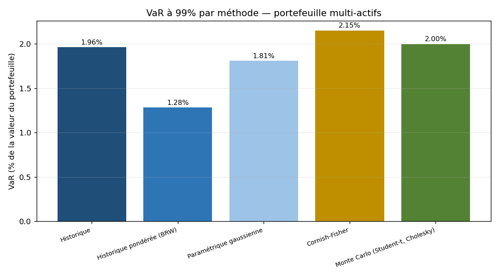
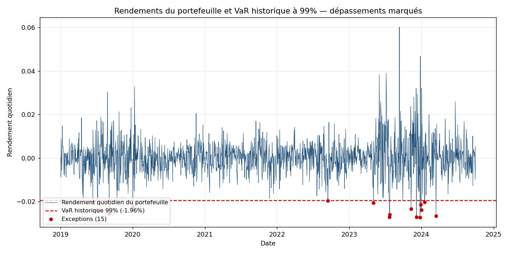
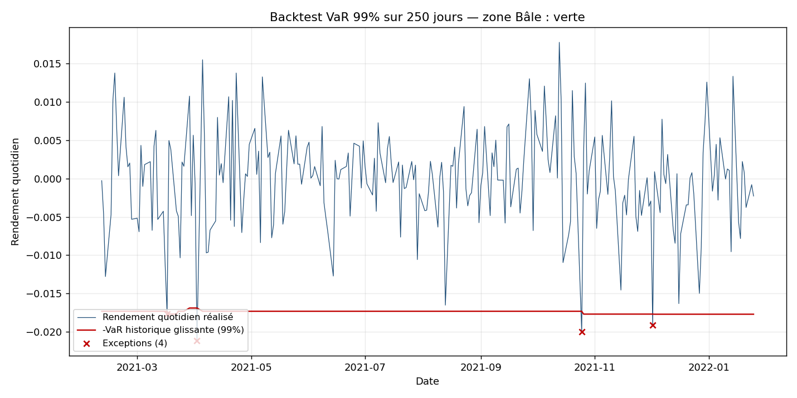
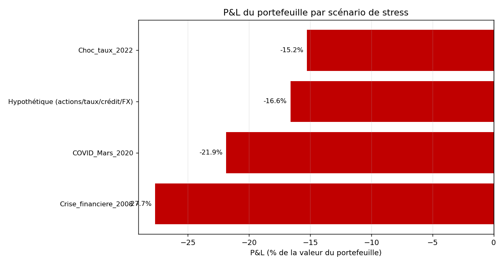
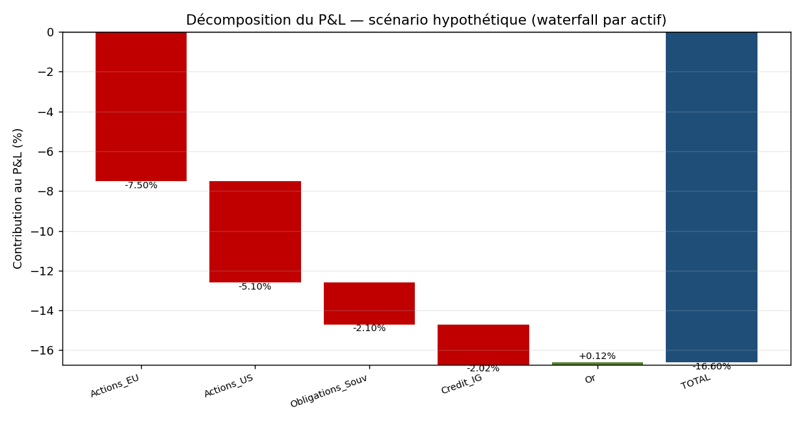
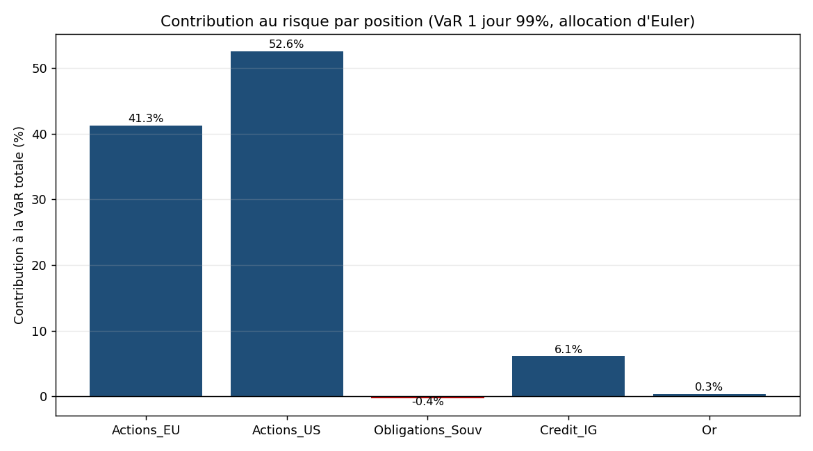
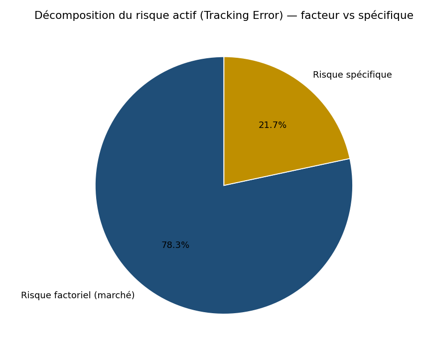
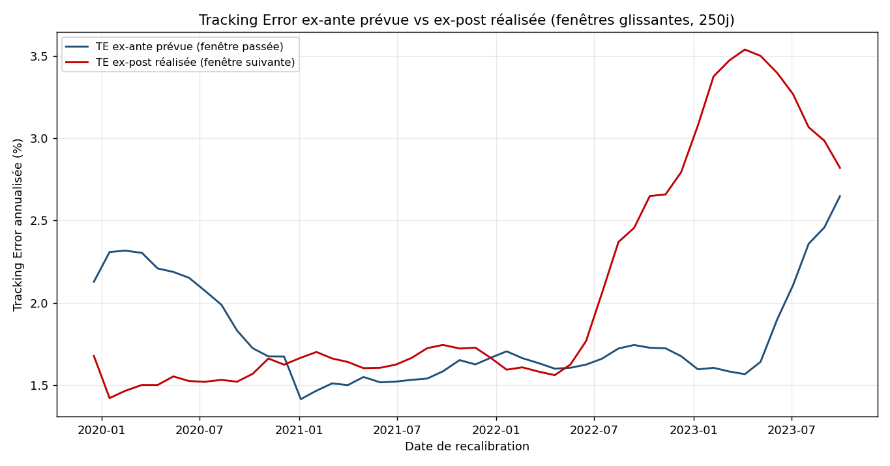

# Market Risk VaR Engine

Moteur de risque de marché en Python — VaR/ES multi-méthodes, backtesting réglementaire, stress tests et risque ex-ante relatif, conçu pour un usage type comité des risques d'un asset manager.

  

## Pourquoi ce projet

Une fonction Risque de marché en société de gestion doit, au quotidien : calculer et publier la VaR et l'Expected Shortfall du portefeuille, backtester ces mesures pour prouver leur fiabilité devant un comité des risques, dérouler des scénarios de stress (historiques et hypothétiques) pour éclairer le dialogue avec les gérants sur les positions les plus vulnérables, et suivre le risque relatif au benchmark (tracking error, contribution au risque par ligne) pour arbitrer les écarts d'allocation.

Ce dépôt reproduit ces briques dans un package Python testé et documenté :

- **VaR/ES** par 5 méthodes (historique, historique pondérée, paramétrique gaussienne, Cornish-Fisher, Monte Carlo) pour comparer les approches et motiver le choix retenu en reporting quotidien.
- **Backtesting réglementaire** (Kupiec, Christoffersen, Traffic Light de Bâle) pour justifier la robustesse du modèle devant un comité des risques.
- **Stress tests** historiques rejoués, hypothétiques paramétriques, stress de corrélation et reverse stress test, pour objectiver les échanges avec les gérants sur les scénarios extrêmes.
- **Risque ex-ante relatif** (tracking error, beta, ratio d'information, décomposition Euler de la VaR) pour le suivi quotidien de l'écart au benchmark et l'allocation du budget de risque par ligne.

## Méthodes implémentées

| Domaine | Méthode | Référence |
|---|---|---|
| VaR | Historique (empirique) | Jorion, P., *Value at Risk*, 3e éd., McGraw-Hill, 2007 |
| VaR | Historique pondérée exponentiellement (BRW) | Boudoukh, Richardson & Whitelaw (1998), « The Best of Both Worlds » |
| VaR | Paramétrique gaussienne (RiskMetrics) | J.P. Morgan/RiskMetrics, *RiskMetrics Technical Document*, 1996 |
| VaR | Cornish-Fisher (ajustement asymétrie/aplatissement) | Zangari, P. (1996) ; Cornish & Fisher (1938) |
| VaR | Monte Carlo (Student-t, décomposition de Cholesky) | Jorion (2007) |
| VaR | Règle racine du temps (scaling horizon) | Comité de Bâle, FRTB, *Minimum capital requirements for market risk*, 2019 |
| Backtesting | Test de couverture inconditionnelle (POF) | Kupiec, P. (1995), « Techniques for Verifying the Accuracy of Risk Measurement Models » |
| Backtesting | Test d'indépendance et de couverture conditionnelle jointe | Christoffersen, P. (1998), « Evaluating Interval Forecasts » |
| Backtesting | Traffic Light (zones verte/orange/rouge) | Comité de Bâle, *Supervisory framework for backtesting*, 1996 |
| Covariance | Shrinkage de Ledoit-Wolf | Ledoit, O. & Wolf, M. (2004), « A well-conditioned estimator for large-dimensional covariance matrices » |
| Stress | Scénarios historiques rejoués et hypothétiques paramétriques | Comité de Bâle, *Stress testing principles*, 2018 |
| Stress | Reverse stress test (distance de Mahalanobis) | Studer, G. (1997), « Maximum Loss for Measurement of Market Risk » |
| Ex-ante | Beta et beta ajusté | Blume, M. (1975), « Betas and Their Regression Tendencies », *Journal of Finance* |
| Ex-ante | Contribution au risque, VaR marginale/composante (Euler) | Menchero, J. (2010), « Risk Attribution and Portfolio Performance Attribution » ; Grinold & Kahn, *Active Portfolio Management*, 2e éd., 1999 |

## Quickstart

```bash
pip install -e ".[dev]"
python examples/01_var_comparison.py
pytest tests -q
```

## Résultats

Tous les chiffres ci-dessous proviennent d'une exécution réelle des scripts `examples/` sur les rendements synthétiques du dépôt (portefeuille 30% Actions EU / 30% Actions US / 20% Obligations souveraines / 15% Crédit IG / 5% Or, 1500 jours de bourse, 2019-01-02 → 2024-10-01).

### 1. Comparaison des méthodes de VaR




À 99% de confiance, la VaR historique s'établit à **1.96%** (ES 2.38%) et la VaR historique pondérée (BRW) à seulement 1.28%, plus réactive aux régimes de volatilité récents. La VaR Cornish-Fisher (2.15%) est la plus conservatrice : elle capture l'asymétrie et l'excès d'aplatissement des rendements simulés, contre 1.81% pour l'approche paramétrique gaussienne qui ignore les queues épaisses. Sur 1500 jours, la VaR historique génère 15 exceptions, exactement le taux attendu de 1.000%.

### 2. Backtest réglementaire (250 jours)



Le backtest sur l'année réglementaire (250 jours, VaR historique glissante calibrée sur 500 jours) enregistre **4 exceptions** (taux observé 1.60% contre 1.0% attendu). Les tests de Kupiec (LR = 0.7691, p = 0.3805) et de Christoffersen (indépendance : LR = 0.1306, p = 0.7178 ; couverture conditionnelle jointe : LR = 0.8998, p = 0.6377) ne rejettent pas l'hypothèse nulle à 5% : le modèle n'est statistiquement pas mis en défaut. Le Traffic Light de Bâle classe le résultat en **zone verte** (probabilité cumulée 89.22%), multiplicateur réglementaire 3.00 sans add-on.

### 3. Stress tests




Les scénarios historiques rejoués donnent une perte de **-27.65%** pour une réplique de la crise financière de 2008, -21.85% pour le krach COVID de mars 2020 et -15.25% pour le choc de taux 2022. Le scénario hypothétique (actions -25%, taux +150bp, spread crédit +120bp, USD +8%) produit une perte de -16.60%, dont -7.50% imputables à la poche Actions EU et -5.10% à la poche Actions US (la position Or amortit légèrement, +0.12%). Le stress de corrélation (toutes les corrélations forcées à 1) fait bondir la volatilité annualisée du portefeuille de 12.54% à 15.95%, soit +27.2% — illustration concrète de la perte de diversification en crise systémique. Le reverse stress test identifie le choc le plus plausible (au sens de la distance de Mahalanobis) menant à une perte de 15% : il concentre l'essentiel du choc sur les deux poches actions (-20.65% Actions EU, -26.31% Actions US).

### 4. Risque ex-ante relatif





Face à un benchmark plus équilibré (25/25/25/15/10), la tracking error ex-ante est estimée sur une fenêtre de calibration de 250 jours (2019-01-02 → 2019-12-17) **puis confrontée** à la tracking error ex-post réalisée sur les 250 jours suivants (2019-12-18 → 2020-12-01), hors échantillon de calibration : **2.13% prévue contre 1.68% réalisée**, soit un ratio réalisé/prévu de 0.79x — le modèle a surestimé le risque relatif sur cette fenêtre précise. Sur l'ensemble de la série glissante (48 points recalibrés tous les 21 jours), le ratio moyen réalisé/prévu est de **1.17x**, signe que le modèle a globalement plutôt sous-estimé la tracking error réalisée sur la période complète — l'écart type de ce ratio dans le temps est précisément ce qu'un suivi de risque doit surveiller pour recalibrer sa fenêtre d'estimation ou son modèle de covariance. Le beta brut est de 1.173 (beta ajusté de Blume : 1.115) pour un ratio d'information de 0.602. La décomposition d'Euler de la VaR totale à 1 jour (**1.84%**, convention de place — une version annualisée par la règle racine du temps donnerait 29.17%, indicative uniquement, cf. Limites) montre que les deux poches actions concentrent l'essentiel du risque (41.3% pour Actions EU, 52.6% pour Actions US), tandis que les Obligations souveraines contribuent négativement (-0.35%, effet diversifiant). Le risque actif se décompose à 78.3% en risque factoriel (exposition au facteur de marché commun) contre 21.7% de risque spécifique.

## Limites & hypothèses

- **Données synthétiques** : les rendements sont générés par un processus GARCH(1,1) multi-actifs à copule de Student, calibré sur des ordres de grandeur réalistes mais non issus de séries de marché réelles. Les chocs des scénarios historiques (2008, COVID, 2022) sont des approximations pédagogiques documentées dans le code, à recalibrer sur données vérifiées avant tout usage en production.
- **Hypothèse de normalité** : la VaR paramétrique gaussienne et la décomposition d'Euler supposent des rendements gaussiens ; l'ajustement Cornish-Fisher et le Monte Carlo Student-t atténuent ce biais sans l'éliminer.
- **Règle racine du temps** : la mise à l'échelle de la VaR 1 jour vers un horizon plus long (`sqrt(horizon)`) suppose des rendements i.i.d. sans autocorrélation ni changement de régime de volatilité — hypothèse fragile en période de stress, comme le rappelle le Comité de Bâle (FRTB, 2019).
- **Instabilité des corrélations en crise** : la matrice de covariance est estimée sur un historique donné (éventuellement shrinkée à la Ledoit-Wolf) ; le stress de corrélation illustre justement que cette matrice n'est pas stable en régime de crise, ce que la VaR ex-ante ne capture pas nativement.
- **Absence de risque de modèle sur les produits non linéaires** : le moteur traite des positions linéaires (poids fixes par classe d'actifs) ; il ne couvre pas le risque de gamma/vega des produits optionnels ni la réévaluation non linéaire nécessaire au full revaluation.

## Bibliographie

- Jorion, P. (2007). *Value at Risk: The New Benchmark for Managing Financial Risk*, 3e éd. McGraw-Hill.
- Kupiec, P. (1995). "Techniques for Verifying the Accuracy of Risk Measurement Models." *Journal of Derivatives*.
- Christoffersen, P. (1998). "Evaluating Interval Forecasts." *International Economic Review*.
- Comité de Bâle sur le contrôle bancaire (1996). *Supervisory Framework for the Use of Backtesting*.
- Comité de Bâle sur le contrôle bancaire (2019). *Minimum Capital Requirements for Market Risk* (FRTB).
- Comité de Bâle sur le contrôle bancaire (2018). *Stress Testing Principles*.
- J.P. Morgan / RiskMetrics Group (1996). *RiskMetrics Technical Document*, 4e éd.
- Ledoit, O. & Wolf, M. (2004). "A Well-Conditioned Estimator for Large-Dimensional Covariance Matrices." *Journal of Multivariate Analysis*.
- Boudoukh, J., Richardson, M. & Whitelaw, R. (1998). "The Best of Both Worlds: A Hybrid Approach to Calculating Value at Risk." *Risk*.
- Cornish, E.A. & Fisher, R.A. (1938). "Moments and Cumulants in the Specification of Distributions." *Revue de l'Institut International de Statistique*.
- Blume, M. (1975). "Betas and Their Regression Tendencies." *Journal of Finance*.
- Menchero, J. (2010). "Risk Attribution and Portfolio Performance Attribution." *MSCI Barra Research*.
- Grinold, R. & Kahn, R. (1999). *Active Portfolio Management*, 2e éd. McGraw-Hill.
- Studer, G. (1997). "Maximum Loss for Measurement of Market Risk." ETH Zürich.

---

## English summary

A tested Python package for market risk management: VaR/ES across five methods (historical, weighted historical, parametric Gaussian, Cornish-Fisher, Monte Carlo), regulatory backtesting (Kupiec, Christoffersen, Basel Traffic Light), stress testing (historical replay, parametric hypothetical, correlation stress, reverse stress test via Mahalanobis distance), and ex-ante relative risk (tracking error, beta, information ratio, Euler risk contribution, factor/specific decomposition). Built to mirror the daily deliverables of a market risk desk at an asset manager. All example scripts run offline on synthetic multi-asset data; see `examples/` for runnable demonstrations and `docs/img/` for the resulting charts.
